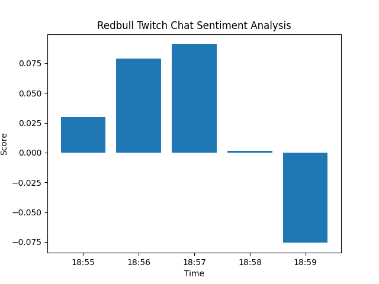
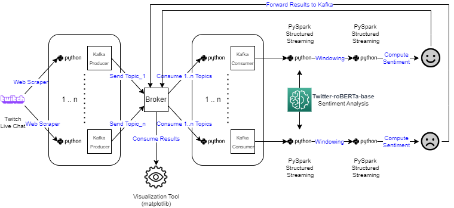

# Twitch Chat Live Sentiment Analysis

## Example Result

## Architecture

## How to run the code

**Prerequisites**

    • Ensure that Java, Hadoop, and Spark are installed, and environment variables are correctly
    set. Especially on Windows, we found it quite tedious to get Spark Sessions to work.
    • Ensure Docker is installed.
    • Install the required packages from requirements.txt. All packages can be installed using the
    pip installer.
    • Sentiment Analyzer uses a PyTorch model, PyTorch can be installed using the commented
    line in the requirements.txt or you can install the version suitable to your setup.
**Start Kafka Broker and Zookeeper**

    • If preferred, change the configuration of Broker and Zookeeper within the docker-
    compose.YAML file.
    • Run docker compose up -d to start Broker and Zookeeper
    • On success, the application will print "Starting zookeeper ... done" and "Starting broker ...
    done" to the console.

**Start the Producer**

    • The producer is located in scraper.py
    • Type python scraper.py –channel <channel_name> to start the producer.
    • The producer will now open a chrome browser window, scrape the chat, and send the
    messages to the Kafka Broker
**Start the Sentiment Analyzer**

    • The Sentiment Analyzer is located in analyzer.py
    • Manually change the TWITCH_USERNAME_LIST variable in the code with your channel.
    • Type python analyzer.py to start the analyzer.
    • The analyzer now is going to consume the messages sent to Kafka, process them and send
    the results of each window back to Kafka.

**Start the Visualizer**

    • The visualizer is located in visualizer.py
    • Before starting the consumer, verify that the variable TWITCH_USERNAME_LIST contains
    the same Twitch channel name as the producer.
    • Type python consumer.py to start the consumer
    • The consumer will now receive messages, infer the sentiment, and print the result to the
    console.

